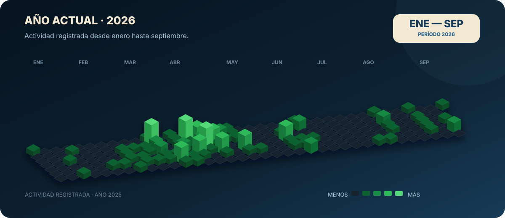

  

<h3 align="center">I build solutions that connect software development, data and artificial intelligence.</h3>

  Final-year Information Systems Engineering student · Co-founder of ESDEC · Córdoba, Argentina

  
  
  

---

## 01 · About Me

I am a final-year **Information Systems Engineering student at UTN Córdoba**, focused on Full Stack development, Data and AI. As co-founder of **ESDEC**, I combine technology, product thinking and business understanding to turn real problems into scalable digital solutions.

---

## 02 · Two Professional Paths

<table>
  <tr>
    <td width="50%" valign="top">
      <h3 align="center">⚡ Full Stack Development</h3>
      
I turn ideas into complete applications, covering architecture, data, backend, frontend, authentication and user experience.

      
<strong>React · Next.js · NestJS · TypeScript · FastAPI · PostgreSQL</strong>

      
<em>Functional, maintainable products designed to grow.</em>

    </td>
    <td width="50%" valign="top">
      <h3 align="center">📊 Data & Artificial Intelligence</h3>
      
I transform data into useful information through analysis, visualization, predictive models and neural networks.

      
<strong>Python · Pandas · NumPy · Power BI · Scikit-learn · TensorFlow</strong>

      
<em>Decisions supported by data and measurable models.</em>

    </td>
  </tr>
</table>

---

## 03 · Skills & Tools

These are the technologies I use to build web products and data-driven solutions.

### Languages

### Development

### Data & AI

### Databases, Infrastructure & Tools

---

## 04 · GitHub Activity

  <strong>Development activity on GitHub</strong> 
  Consistency, continuous learning and products built over the last 12 months.

  

  
<strong>📅 View current year only · 2026</strong>

   
  

    
  

  <a href="https://github.com/Manuel-Cavina?tab=overview"><strong>Explore my complete GitHub activity →</strong></a>

---

## 05 · Featured Projects

<table>
  <tr>
    <td width="50%" valign="top">
      <h3>🏃 ESDEC</h3>
      
<strong>Integrated sports technology product.</strong> A platform designed to connect clubs, athletes, coaches and professionals through planning, performance tracking, health, well-being and data.

      
<strong>My role:</strong> functional analysis, product architecture and web development.

      
<code>Next.js</code> <code>TypeScript</code> <code>NestJS</code> <code>PostgreSQL</code> <code>Prisma</code>

      
<a href="https://esdec.com.ar/"><strong>Visit product →</strong></a> · <a href="https://github.com/Manuel-Cavina/ESDEC">Source code</a>

    </td>
    <td width="50%" valign="top">
      <h3>🚀 Odisea Marketing</h3>
      
<strong>A digital presence designed for conversion.</strong> A responsive website built to communicate the agency's services, identity and commercial value clearly and attractively.

      
<strong>My role:</strong> web development, content structure and visual implementation.

      
<code>Web Development</code> <code>Responsive UI</code> <code>UX</code>

      
<a href="https://www.odiseamarketing.com/"><strong>Visit website →</strong></a>

    </td>
  </tr>
  <tr>
    <td width="50%" valign="top">
      <h3>🌧️ Rainfall Prediction</h3>
      
<strong>Applied Machine Learning.</strong> A classification pipeline including data preparation, feature engineering, cross-validation, hyperparameter tuning and model evaluation.

      
<code>Python</code> <code>Pandas</code> <code>Scikit-learn</code>

      
<em>Repository coming soon.</em>

    </td>
    <td width="50%" valign="top">
      <h3>🧠 Deep Learning with Keras</h3>
      
<strong>Neural networks for classification.</strong> Design and training of dense neural architectures, hyperparameter experimentation and performance analysis.

      
<code>Python</code> <code>Keras</code> <code>TensorFlow</code>

      
<em>Repository coming soon.</em>

    </td>
  </tr>
</table>

---

## 06 · Highlights

- Co-founder and systems analyst at **ESDEC**.
- Developed and launched the **ESDEC** and **Odisea Marketing** websites.
- Built **AYCI** end to end, from architecture and data modeling to frontend, backend and authentication.
- **Machine Learning with Python** certification — IBM / Coursera.
- **Introduction to Deep Learning & Neural Networks with Keras** certification — IBM / Coursera.
- Final-year **Information Systems Engineering** student — UTN FRC.

---

  <h3>Have an idea, a challenge or a product to build?</h3>
  
Let's connect software development, data and artificial intelligence to turn it into a real solution.

  
  

