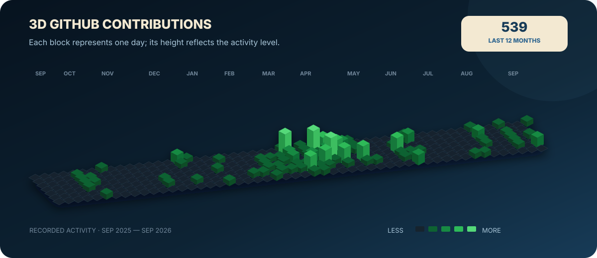

  

<h3 align="center">Construyo soluciones que combinan desarrollo, datos e inteligencia artificial.</h3>

  Estudiante avanzado de Ingeniería en Sistemas · Cofundador de ESDEC · Córdoba, Argentina

  
  
  

---

## 01 · Mis dos perfiles

<table>
  <tr>
    <td width="50%" valign="top">
      <h3 align="center">⚡ Desarrollo Full Stack</h3>
      
Convierto una idea en una aplicación completa: arquitectura, datos, backend, frontend, autenticación y experiencia de usuario.

      
<strong>React · Next.js · NestJS · TypeScript · FastAPI · PostgreSQL</strong>

      
<em>Productos funcionales, mantenibles y preparados para crecer.</em>

    </td>
    <td width="50%" valign="top">
      <h3 align="center">📊 Datos & Inteligencia Artificial</h3>
      
Transformo datos en información útil mediante análisis, visualización, modelos predictivos y redes neuronales.

      
<strong>Python · Pandas · NumPy · Power BI · Scikit-learn · TensorFlow</strong>

      
<em>Decisiones respaldadas por datos y modelos evaluables.</em>

    </td>
  </tr>
</table>

---

## 02 · Mis contribuciones

  

  <a href="https://github.com/Manuel-Cavina?tab=overview"><strong>Explorar mi actividad completa →</strong></a>

---

## 03 · Mis proyectos

<table>
  <tr>
    <td width="50%" valign="top">
      <h3>🏃 ESDEC</h3>
      
<strong>Producto deportivo integral.</strong> Plataforma para conectar clubes, deportistas, entrenadores y profesionales mediante planificación, seguimiento, salud, bienestar y datos.

      
<strong>Mi aporte:</strong> análisis funcional, arquitectura del producto y desarrollo web.

      
<code>Next.js</code> <code>TypeScript</code> <code>NestJS</code> <code>PostgreSQL</code> <code>Prisma</code>

      
<a href="https://esdec.com.ar/"><strong>Visitar producto →</strong></a> · <a href="https://github.com/Manuel-Cavina/ESDEC">Código</a>

    </td>
    <td width="50%" valign="top">
      <h3>🚀 Odisea Marketing</h3>
      
<strong>Presencia digital orientada a conversión.</strong> Sitio responsive creado para comunicar servicios, identidad y propuesta comercial de forma clara y atractiva.

      
<strong>Mi aporte:</strong> desarrollo web, estructura de contenidos e implementación visual.

      
<code>Web Development</code> <code>Responsive UI</code> <code>UX</code>

      
<a href="https://www.odiseamarketing.com/"><strong>Visitar sitio →</strong></a>

    </td>
  </tr>
  <tr>
    <td width="50%" valign="top">
      <h3>🌧️ Rainfall Prediction</h3>
      
<strong>Machine Learning aplicado.</strong> Pipeline de clasificación con preparación de datos, feature engineering, validación cruzada, ajuste de hiperparámetros y evaluación de métricas.

      
<code>Python</code> <code>Pandas</code> <code>Scikit-learn</code>

      
<em>Repositorio próximo a publicarse.</em>

    </td>
    <td width="50%" valign="top">
      <h3>🧠 Deep Learning con Keras</h3>
      
<strong>Redes neuronales para clasificación.</strong> Diseño y entrenamiento de arquitecturas densas, experimentación con hiperparámetros y análisis del rendimiento del modelo.

      
<code>Python</code> <code>Keras</code> <code>TensorFlow</code>

      
<em>Repositorio próximo a publicarse.</em>

    </td>
  </tr>
</table>

---

## 04 · Mis objetivos

  

- 🎯 **Objetivo actual:** completar AWS Certified AI Practitioner. Progreso: **40%**.
- ☁️ **Siguiente etapa:** AWS Certified Cloud Practitioner.
- 🏗️ **Profundización:** arquitectura de soluciones escalables en AWS.
- 📊 **Especialización:** ingeniería de datos y Machine Learning sobre la nube.
- 💼 **Meta profesional:** aportar en equipos reales y construir productos con impacto medible.

---

## 05 · Mis tecnologías

### Lenguajes

### Desarrollo

### Datos & IA

### Datos, infraestructura y herramientas

---

## 06 · Un poco sobre mí

Soy estudiante de quinto año de **Ingeniería en Sistemas de Información en la UTN Córdoba**, próximo a egresar. Me gusta comprender el problema completo antes de escribir código: quién lo necesita, qué valor debe generar y cómo construir una solución que pueda mantenerse y evolucionar.

Como cofundador de **ESDEC - Elite Sports Development**, combino análisis de sistemas, producto, tecnología y visión de negocio. Paralelamente, profundizo mi formación en AWS, Machine Learning e inteligencia artificial generativa para integrar esas capacidades en productos reales.

### Logros que respaldan mi recorrido

- Cofundador y analista de sistemas de **ESDEC**.
- Desarrollo y publicación de los sitios de **ESDEC** y **Odisea Marketing**.
- Construcción integral de **AYCI**, desde la arquitectura y el modelo de datos hasta frontend, backend y autenticación.
- Certificación **Machine Learning with Python** — IBM / Coursera.
- Certificación **Introduction to Deep Learning & Neural Networks with Keras** — IBM / Coursera.
- Quinto año de **Ingeniería en Sistemas de Información** — UTN FRC.

---

  <h3>¿Tenés una idea, un desafío o un producto para construir?</h3>
  
Conectemos desarrollo, datos e inteligencia artificial para convertirlo en una solución real.

  
  

