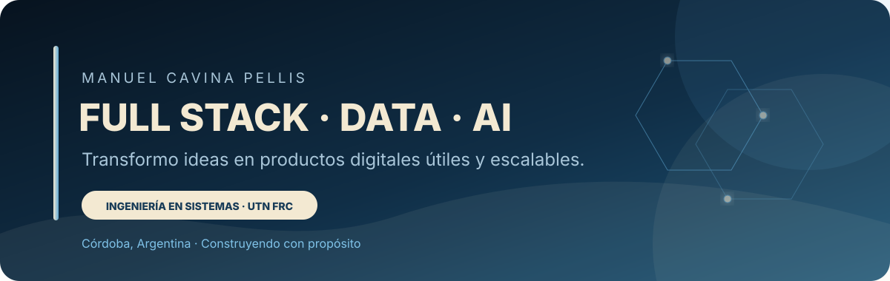
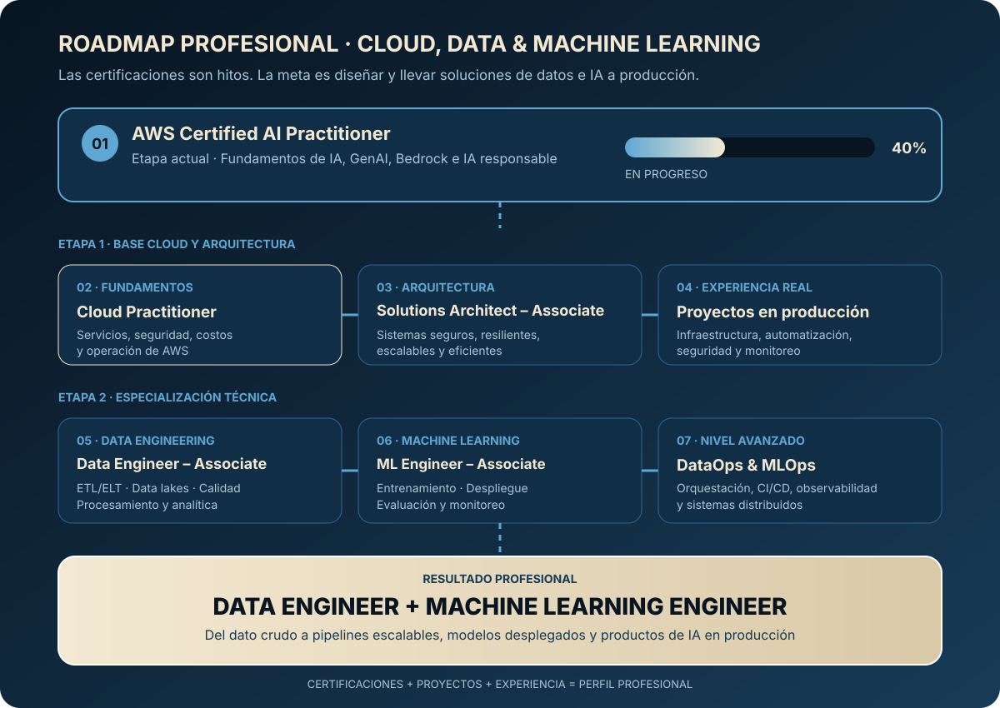

  

  
  
  

## Sobre mí

Soy estudiante de quinto año de **Ingeniería en Sistemas de Información en la UTN Córdoba**, próximo a egresar. Desarrollo mi perfil profesional en dos áreas que se complementan:

- **Desarrollo Full Stack:** construcción de aplicaciones web completas, desde la arquitectura y el modelado de datos hasta el backend, el frontend y la autenticación.
- **Datos e Inteligencia Artificial:** análisis de datos, preparación de información, modelos de Machine Learning y redes neuronales con Python.

También soy cofundador de **ESDEC - Elite Sports Development**, donde participo en el análisis, diseño y desarrollo de una plataforma orientada a profesionalizar la gestión y el desarrollo deportivo.

Actualmente profundizo mi formación en **AWS e inteligencia artificial generativa**, buscando crear soluciones útiles, escalables y conectadas con problemas reales.

## Roadmap de aprendizaje

  

Mi objetivo actual es completar **AWS Certified AI Practitioner**. Luego continuaré con **Cloud Practitioner** para consolidar los fundamentos de la nube y avanzar progresivamente hacia certificaciones de arquitectura, datos y Machine Learning.

## Mis dos perfiles

<table>
  <tr>
    <td width="50%" valign="top">
      <h3 align="center">Desarrollo Full Stack</h3>
      
Interfaces modernas, APIs, autenticación, bases de datos y arquitectura de aplicaciones.

      
<strong>React · Next.js · NestJS · TypeScript · FastAPI · PostgreSQL</strong>

    </td>
    <td width="50%" valign="top">
      <h3 align="center">Datos & IA</h3>
      
Análisis, visualización, modelos predictivos, evaluación de métricas y Deep Learning.

      
<strong>Python · Pandas · NumPy · Power BI · Scikit-learn · TensorFlow</strong>

    </td>
  </tr>
</table>

## Logros destacados

- Cofundador de **ESDEC - Elite Sports Development** y participante activo en el análisis, diseño y desarrollo de su plataforma digital.
- Desarrollo y publicación de los sitios web de **ESDEC** y **Odisea Marketing**.
- Construcción de **AYCI**, una aplicación Full Stack desarrollada desde la arquitectura y el modelo de datos hasta el frontend, backend y autenticación.
- Certificación **Machine Learning with Python** de IBM / Coursera.
- Certificación **Introduction to Deep Learning & Neural Networks with Keras** de IBM / Coursera.
- Formación de quinto año en **Ingeniería en Sistemas de Información** en la UTN Córdoba.

## Tecnologías

### Lenguajes

### Desarrollo web

### Datos e inteligencia artificial

### Bases de datos y herramientas

## Proyectos destacados

<table>
  <tr>
    <td width="50%" valign="top">
      <h3>ESDEC</h3>
      
Plataforma digital para clubes, deportistas, entrenadores y profesionales. Integra planificación, seguimiento, salud, bienestar y análisis de información.

      
<strong>Next.js · TypeScript · NestJS · PostgreSQL · Prisma</strong>

      <a href="https://esdec.com.ar/">Visitar sitio web</a> · <a href="https://github.com/Manuel-Cavina/ESDEC">Ver repositorio</a>
    </td>
    <td width="50%" valign="top">
      <h3>Odisea Marketing</h3>
      
Sitio web desarrollado para presentar servicios, identidad y propuesta comercial de una agencia de marketing.

      
<strong>Desarrollo web · UI responsive · Experiencia de usuario</strong>

      <a href="https://www.odiseamarketing.com/">Visitar sitio web</a>
    </td>
  </tr>
  <tr>
    <td width="50%" valign="top">
      <h3>Rainfall Prediction Classifier</h3>
      
Pipeline de clasificación sobre un dataset real, con preparación de datos, feature engineering, validación cruzada, búsqueda de hiperparámetros y evaluación de métricas.

      
<strong>Python · Pandas · Scikit-learn · Machine Learning</strong>

      <em>Enlace pendiente de incorporar</em>
    </td>
    <td width="50%" valign="top">
      <h3>Deep Learning con Keras</h3>
      
Diseño y entrenamiento de redes neuronales densas, experimentando con arquitecturas, hiperparámetros y clasificación.

      
<strong>Python · Keras · TensorFlow · Deep Learning</strong>

      <em>Enlace pendiente de incorporar</em>
    </td>
  </tr>
</table>

## Formación y certificaciones

- **Ingeniería en Sistemas de Información** - Universidad Tecnológica Nacional, Facultad Regional Córdoba.
- **Machine Learning with Python** - IBM / Coursera.
- **Introduction to Deep Learning & Neural Networks with Keras** - IBM / Coursera.
- Formación actual orientada a **AWS e inteligencia artificial generativa**.

   
  <strong>Construyendo soluciones donde el desarrollo, los datos y la inteligencia artificial se encuentran.</strong>

